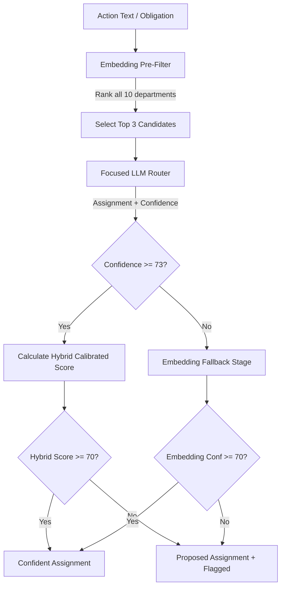

# Downstream Routing Agent (Stage 2 & 3)

The **Downstream Routing Agent** is an intelligent, two-stage semantic routing pipeline designed to assign regulatory compliance obligations (extracted from RBI circulars) to the most appropriate business department and sub-vertical within a commercial bank.

It replaces standard, brittle keyword/regex matching with context-aware semantic reasoning and multi-modal vector alignment.

---

## 1. Core Architecture

The routing pipeline operates in a two-stage process to optimize both **accuracy** and **latency**:



### Stage 1: Candidate Pre-Filtering + Focused LLM
1. **Semantic Similarity Scan**: The action text is embedded using `mxbai-embed-large` and compared against the scope descriptions of all 30 sub-verticals.
2. **Top-3 Filtering**: The taxonomy is sliced to keep only the **top 3 candidate departments** with the highest semantic similarity.
3. **Focused LLM Call**: A short-context prompt is constructed containing *only* the top 3 candidates and their sub-vertical scopes. This avoids overwhelming the `llama3.2:latest` (3.2B) model, dropping latency by ~70% (from 11s down to 3-4s) and completely eliminating hallucinations to irrelevant departments.
4. **LLM Assignment**: If the LLM makes an assignment with $\ge$ High confidence (`high` or `very_high`), it passes to the Hybrid Calibration phase.

### Stage 2: Embedding Fallback
If the LLM is under-confident (confidence $\le$ Medium), the router falls back to the absolute best match found in the vector embedding space (highest cosine similarity against scope definitions).

---

## 2. Hybrid Calibration Confidence Scoring

To prevent LLM overconfidence and ground assignments in institutional facts, the pipeline calculates a **Hybrid Calibrated Confidence Score** at every step:

$$\text{Unified Confidence} = 0.40 \cdot C_{LLM} + 0.60 \cdot C_{Embed}$$

Where:
* **$C_{LLM}$** is the LLM's integer score: `very_high` (88), `high` (73), `medium` (52), `low` (32).
* **$C_{Embed}$** is the embedding router's confidence score ($0 - 100$) based on two metrics:

### Embedding Confidence Component ($C_{Embed}$)
$$C_{Embed} = \text{round}(0.55 \cdot \text{Strength} + 0.45 \cdot \text{Clarity})$$

1. **Strength (Absolute Match Quality)**:
   $$\text{Strength} = \text{clamp}\left(\frac{S_{dept} - 0.40}{0.90 - 0.40}, 0, 1\right)$$
   Where $S_{dept}$ is the cosine similarity score of the evaluated department.
2. **Clarity (Margin/Uniqueness)**:
   * **If LLM and Embedding top choice agree**:
     $$\text{Margin} = S_{dept} - S_{second}$$
   * **If LLM and Embedding top choice disagree (Conflict)**:
     $$\text{Margin} = S_{dept} - S_{top\_embedding} \quad (\text{yields a negative margin})$$
   $$\text{Clarity} = \text{clamp}\left(\frac{\text{Margin}}{0.15}, -1.0, 1.0\right)$$

A negative margin (conflict) heavily penalizes the embedding confidence component, correctly dragging down the final hybrid score and triggering a flagged review.

---

## 3. Threshold Tiers & Routing Decisions

Instead of overwriting low-confidence decisions to "Unassigned", the system **always proposes the best matching department**, using the confidence score to set a validation flag for the frontend:

| Score | Status | `routing_flagged` | Action Taken |
| :--- | :--- | :--- | :--- |
| **$\ge$ 70%** | **Confident Assignment** | `false` | Assigns proposed department, sends automated notification. |
| **< 70%** | **Flagged Assignment** | `true` | Assigns proposed department, highlights card for human validation. |

---

## 4. Ingested Taxonomy & Scope
The routing agent maps obligations across 10 main departments containing 30 sub-verticals and their exact scopes (sourced from `theme_2.xlsx`):

* **Digital Banking Services** (Internet/Mobile banking portals, Digital Lending, APIs)
* **Cybersecurity Wing** (SOC, Vulnerability Management, IAM, Security Architecture)
* **IT Vertical** (Infrastructure, Cloud Operations, App Management, BCP/DR)
* **Procurement & Vendor Management** (IT Procurement, Third-Party Risk, Cloud Vendor Management)
* **Credit Card Vertical** (Card Issuance, Operations, Disputes)
* **Payments Vertical** (UPI, NEFT, RTGS, Merchant Acquiring)
* **Compliance Department** (Regulatory Compliance, AML/CFT)
* **Legal Department** (Contract Management, Privacy & Data Protection)
* **Risk Management** (Operational Risk, Technology Risk)
* **Internal Audit** (Information Systems Audit, Regulatory Audit)

---

## 5. Execution Instructions

The routing agent is executed via the unified pipeline runner:

```bash
# In the virtual environment
.venv/bin/python3 run_pipeline.py --mode route_only --model llama3.2:latest
```

This reads from `backend/arca/arca_output.json`, routes all obligations using the 2-stage hybrid calibrated pipeline, and outputs the augmented metadata into `backend/arca/arca_output_routed.json`.

---

## 6. Frontend Integration Guidelines

For the frontend developers building the compliance dashboard, each obligation (MAP) entry in the output JSON [arca_output_routed.json](file:///Users/nidhimithiya/Desktop/Arca/backend/arca/arca_output_routed.json) now contains the following schema:

```json
{
  "action": "Establish and maintain a robust cyber security/resilience framework...",
  "department": "Cybersecurity Wing",
  "routing_confidence": 89,
  "routing_reasoning": "The obligation aligns directly with the Security Architecture scope.",
  "routing_source": "LLM Router (Stage 1) [filtered: Cybersecurity Wing, IT Vertical, Risk Management]",
  "routing_flagged": false
}
```

### UI Presentation Checklist
1. **Routing Status Banner**: 
   * Filter cards by `"department"`.
   * If `"routing_flagged"` is `true`, render an **attention/warning badge** (e.g., `⚠️ Flagged for Review`) on the card.
   * Render the `"routing_confidence"` percentage as a visual progress bar or badge (Green for $\ge 70\%$, Orange/Red for $< 70\%$).
2. **Hover Tooltip / Expansion Panel**:
   * Show the `"routing_reasoning"` to help the compliance officer understand *why* the AI chose this department.
   * Display the `"routing_source"` to indicate whether it was routed by Stage 1 (LLM) or Stage 2 (Embedding Fallback).
3. **One-Click Human Verification Actions**:
   * **Approve Button**: If the suggested department is correct, clicking "Approve" sets `"routing_flagged"` to `false` and locks the assignment.
   * **Re-assign Dropdown**: Show a dropdown containing the 10 bank departments. Selecting a new department updates the `"department"` value, sets `"routing_confidence"` to `100` (manual override), and clears `"routing_flagged"` to `false`.
