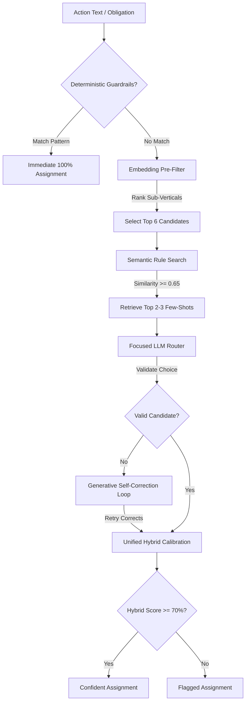

# Downstream Routing Agent (Stage 2 & 3)

The **Downstream Routing Agent** is an intelligent, two-stage semantic routing pipeline designed to assign regulatory compliance obligations (extracted from RBI circulars) to the most appropriate business department and sub-vertical within a commercial bank. 

It replaces standard, brittle keyword/regex matching with context-aware semantic reasoning, dynamic rule injection, deterministic guardrail overrides, self-correcting logic, and a secure JSON database store.

---

## 1. Core Pipeline Architecture

The routing pipeline uses a hybrid, multi-stage architecture to maximize classification accuracy while keeping latency low:



### Stage 1: Pre-LLM Pre-Filtering & Dynamic Rule Injection
1. **Deterministic Guardrails Override**: Prior to running embeddings or LLM logic, the input text is matched against keyword patterns defined in [routing_rules.json](file:///Users/nidhimithiya/Desktop/Arca/backend/routing_agent/routing_rules.json). If a pattern is found (e.g. `"FEMA compliance"`), it immediately assigns the target department with 100% confidence, bypassing the downstream AI pipeline completely.
2. **Sub-Vertical Semantic Filtering**: The obligation is embedded using `mxbai-embed-large` and compared against all active sub-vertical scope definitions. The pipeline slices the taxonomy to keep only the **top 6 candidate sub-verticals**.
3. **Dynamic Few-Shot Retrieval**: The agent queries the database for past resolved cases matching this action using cosine similarity. The top 2-3 matched rules (with similarity $\ge 0.65$) are fetched and injected directly into the LLM prompt under a `Similar Past Decisions` section.
4. **Focused LLM Assignment**: A prompt containing *only* the top 6 candidate scopes and few-shot rules is sent to the `llama3.2:latest` model. This drops latency significantly and prevents hallucinations.

### Stage 2: Generative Self-Correction & Embedding Fallback
1. **Self-Correction Retry**: If the LLM returns an invalid department or sub-vertical name that is not present in the allowed top-6 candidate set, the agent executes a self-healing retry. It re-prompts the LLM with the invalid output, the validation error, and the list of allowed candidate sub-verticals.
2. **Embedding Fallback**: If the LLM is under-confident (confidence score < 52 / `medium`) or fails self-correction, the system falls back to the absolute best match found in the vector embedding space.

---

## 2. Hybrid Calibration Confidence Scoring

To prevent LLM hallucinations and align assignments with vector space similarity, the pipeline calculates a **Hybrid Calibrated Confidence Score**:

$$\text{Unified Confidence} = 0.65 \cdot C_{LLM} + 0.35 \cdot C_{Embed}$$

Where:
* **$C_{LLM}$** is the LLM's integer score: `very_high` (88), `high` (73), `medium` (52), `low` (32).
* **$C_{Embed}$** is the embedding router's confidence score ($0 - 100$) based on two metrics:

### Embedding Confidence Component ($C_{Embed}$)
$$C_{Embed} = \text{round}(0.55 \cdot \text{Strength} + 0.45 \cdot \text{Clarity})$$

1. **Strength (Absolute Match Quality)**:
   $$\text{Strength} = \text{clamp}\left(\frac{S_{dept} - 0.40}{0.90 - 0.40}, 0, 1\right)$$
   Where $S_{dept}$ is the cosine similarity score of the evaluated department.
2. **Clarity (Margin/Uniqueness)**:
   * **If LLM and Embedding top choice agree**:
     $$\text{Margin} = S_{dept} - S_{second}$$
   * **If LLM and Embedding top choice disagree (Conflict)**:
     $$\text{Margin} = S_{dept} - S_{top\_embedding} \quad (\text{yields a negative margin})$$
   $$\text{Clarity} = \text{clamp}\left(\frac{\text{Margin}}{0.15}, -1.0, 1.0\right)$$

A negative margin (conflict) heavily penalizes the embedding confidence component, correctly dragging down the final hybrid score and triggering a flagged review.

---

## 3. Database Store with Locking & Atomic Writes

The routing rules, taxonomy definitions, and guardrail patterns are persisted in a JSON database [routing_rules.json](file:///Users/nidhimithiya/Desktop/Arca/backend/routing_agent/routing_rules.json) managed by the [RulesStore](file:///Users/nidhimithiya/Desktop/Arca/backend/routing_agent/rules_store.py#L7) class:

* **Atomic Writes**: Saves are written to a temporary file in the same folder first, then replaced atomically using `os.replace` to prevent data corruption.
* **File Locking**: Acquires a cross-process lock on `routing_rules.json.lock` using python's `fcntl.flock(lock_f, fcntl.LOCK_EX)` during any save/write operation.
* **Embedding Cache Seeding**: Resolved few-shot rules are stored with their pre-calculated embedding vectors (`embedding`) in the JSON database, avoiding redundant Ollama embedding query latency during runtime semantic search.

---

## 4. Execution Instructions

The routing agent is executed via the unified pipeline runner:

```bash
# In the virtual environment
.venv/bin/python3 run_pipeline.py --mode route_only --model llama3.2:latest
```

This reads from `backend/arca/arca_output.json`, routes all obligations using the production-grade pipeline, and outputs the augmented metadata into [arca_output_routed.json](file:///Users/nidhimithiya/Desktop/Arca/backend/arca/arca_output_routed.json).

### Running Verification Tests
Execute the test suite to verify guardrails, few-shot prompt injection, self-correction, and the feedback loop:

```bash
.venv/bin/python3 backend/routing_agent/verify_production_agent.py
```

---

## 5. API & Frontend Integration Guidelines

### Routing Result Output Schema
Each routed obligation in [arca_output_routed.json](file:///Users/nidhimithiya/Desktop/Arca/backend/arca/arca_output_routed.json) follows this schema:

```json
{
  "action": "Ensure that all mobile banking portal sessions terminate after 5 minutes of inactivity.",
  "assigned_department": "Digital Banking Services",
  "sub_vertical": "Mobile Banking (MB)",
  "sub_vertical_scope": "Mobile banking apps and services",
  "confidence": 85,
  "reasoning": "The action text specifies session timeouts for mobile banking applications, which falls under Mobile Banking.",
  "routing_source": "LLM Router (Stage 1)",
  "routing_flagged": false,
  "proposed_candidates": [
    {
      "department": "Digital Banking Services",
      "sub_vertical": "Mobile Banking (MB)",
      "confidence": 85,
      "source": "LLM Router (Stage 1)"
    },
    {
      "department": "Digital Banking Services",
      "sub_vertical": "Internet Banking (IB)",
      "confidence": 62,
      "source": "Embedding Similarity (Alternative)"
    }
  ],
  "routing_trace": {
    "guardrail_triggered": false,
    "retrieved_rules": [
      {
        "action": "Ensure mobile banking application locks users out after consecutive failed password attempts.",
        "department": "Digital Banking Services",
        "sub_vertical": "Mobile Banking (MB)",
        "reasoning": "Security policies for mobile banking applications are under Mobile Banking."
      }
    ],
    "self_correction_attempts": 0,
    "validation_errors": []
  },
  "notification_sent": true
}
```

### UI Presentation Checklist
1. **Routing Status Banner**: Render the `assigned_department` and `sub_vertical`.
   * If `routing_flagged` is `true`, render an **attention/warning badge** (e.g., `⚠️ Flagged for Review`).
   * Render the `confidence` percentage as a visual status bar (Green for $\ge 70\%$, Orange/Red for $< 70\%$).
2. **Hover Tooltip / Expansion Panel**:
   * Show the `reasoning` and the `routing_source` (indicates whether it was routed via Guardrails, LLM, or Fallback).
   * Expose the `routing_trace` in an advanced metadata view for compliance auditing.
3. **Alternative Options Dropdown**:
   * Use the `proposed_candidates` array to populate a choice set for human verification, sorted by confidence.
4. **Approve Action**: If the suggested assignment is approved, set `routing_flagged` to `false` and lock the assignment.

### Human Feedback Loop API
Exposed via the [RoutingAgent.resolve_ambiguous_case](file:///Users/nidhimithiya/Desktop/Arca/backend/routing_agent/routing_agent.py#L255) method. When a compliance officer overrides an assignment:

```python
agent.resolve_ambiguous_case(
    action="Monitor digital asset transactions for unusual wallet addresses",
    assigned_dept="Compliance Department",
    assigned_sub_vertical="AML/CFT",
    scope="Monitoring transaction addresses and tracking wallets", # optional
    reasoning="Manual override by Senior Compliance Officer"
)
```

**Under the Hood:**
* If the `assigned_sub_vertical` is not in the current taxonomy, it is added dynamically to the active `taxonomy` section of `routing_rules.json`.
* An embedding vector is computed for the action and stored alongside it under the `rules` array.
* The system triggers `EmbeddingRouter.reload()`, immediately updating the cached embeddings vectors so subsequent routing requests can instantly query the new mapping.
* The rules database is saved atomically using cross-process file locking.

