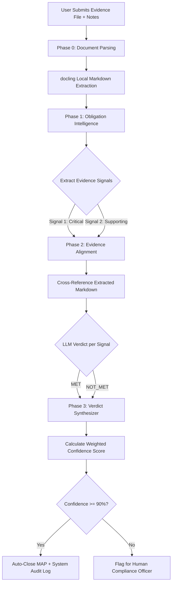

# Validation Agent (Gate 2)

The **Validation Agent** is an autonomous compliance evaluation engine that operates offline to score and validate user-submitted evidence against extracted regulatory obligations (MAPs). It acts as a digital Compliance Officer, cross-referencing extracted signals against uploaded documents to compute deterministic compliance scores.

---

## 1. Core Pipeline Architecture

The validation pipeline uses an orchestrated, multi-phase AI framework running locally on the **Qwen 2.5 (7B)** model to guarantee absolute offline privacy for sensitive banking operations:



### Phase 0: Local Document Parsing (`docling`)
When evidence (`.pdf`, `.docx`) is uploaded, it bypasses traditional OCR layers. Instead, `parse_document_with_docling()` uses IBM's `docling` library locally to extract the physical layout into a structured Markdown representation. This preserves tables, clauses, and lists without relying on external cloud APIs.

### Phase 1: Obligation Intelligence (`obligation_intel.py`)
Before analyzing the evidence, the agent needs to understand the *obligation*. `qwen2.5:7b` ingests the action text and generates a precise JSON array of `evidence_signals`.
* Each signal is assigned a weight: `CRITICAL`, `IMPORTANT`, or `SUPPORTING`.
* Example Signal: *"Screenshot proving 5-minute session timeout configuration."*

### Phase 2: Evidence Alignment (`evidence_aligner.py`)
The generated signals are checked against the combined document markdown and user notes. The LLM evaluates whether the evidence satisfies the signal constraints and returns a categorical status (`MET`, `PARTIALLY_MET`, `NOT_MET`) alongside an explanatory `reasoning` trace citing specific text.

### Phase 3: Verdict Synthesizer (`verdict_synthesizer.py`)
A deterministic rules engine evaluates the outputs of Phase 2 to prevent hallucinated compliance.

---

## 2. Deterministic Scoring Logic

The overall confidence is calculated using a weighted fractional multiplier applied to the signal results:

$$\text{Total Earned} = \sum (\text{Weight}_i \times \text{Status}_i)$$
$$\text{Confidence (\%)} = \left( \frac{\text{Total Earned}}{\sum \text{Weight}_i} \right) \times 100$$

### Weight Coefficients
* **CRITICAL**: $3.0$
* **IMPORTANT**: $2.0$
* **SUPPORTING**: $1.0$

### Status Multipliers
* **MET**: $1.0$
* **PARTIALLY_MET**: $0.5$
* **NOT_MET**: $0.0$

**Verdict Boundaries:**
* **Satisfied**: Confidence $\ge 75\%$
* **Partial**: $45\% \le$ Confidence $< 75\%$
* **Not Satisfied**: Confidence $< 45\%$

### Auto-Close Guardrails
If the verdict is `Satisfied` AND the calculated confidence is **$\ge 90\%$**, the agent executes an **Auto-Close**:
1. Marks the MAP status as `closed`.
2. Triggers an immutable System Audit Log entry denoting `AUTO_CLOSE` via `ARCA Validation Agent`.

---

## 3. Usage & Invocation

The validation engine is invoked natively within FastAPI's background tasks to avoid blocking the HTTP request thread during long LLM generations.

```python
# main.py
from validation_agent.validation_agent import run_validation_background

@app.post("/api/maps/{map_id}/evidence")
async def upload_evidence(map_id: str, file: UploadFile = File(...), background_tasks: BackgroundTasks):
    # ... handle file saving ...
    background_tasks.add_task(run_validation_background, str(db_evidence.id))
    return {"message": "Evidence submitted successfully"}
```

### Signal Breakdown Output
The output JSON saved to the database expands the evidence with a `signal_breakdown` trace, deeply aiding the Human-In-The-Loop (HITL) auditing process in Gate 2.

```json
{
  "verdict": "Satisfied",
  "confidence": 85,
  "missing_elements": [],
  "reasoning": "Evidence satisfied 85% of the required signals based on the document content.",
  "signal_breakdown": [
    {
      "signal": "Verification of password timeout policy",
      "weight": "CRITICAL",
      "status": "MET",
      "confidence": 95,
      "reasoning": "Section 4.1 explicitly states 5-minute timeout."
    }
  ]
}
```
